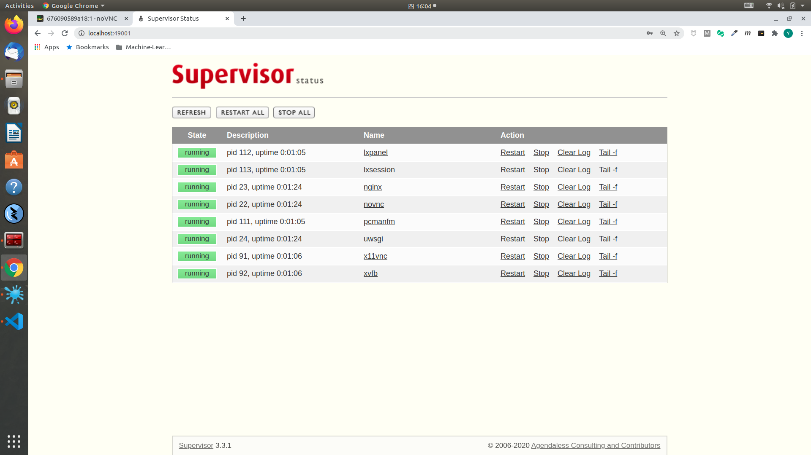
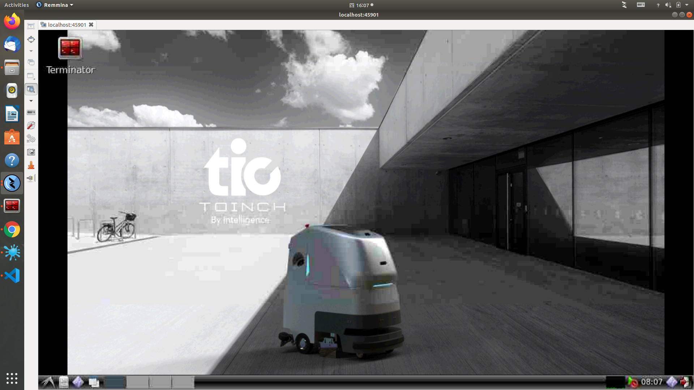
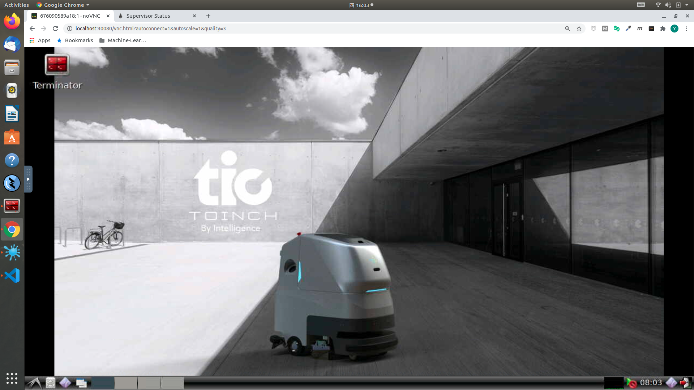

# Docker for ROS, Theory and Practice

This is the Docker image for [ROS, Theory and Practice, 深蓝学院](https://www.shenlanxueyuan.com/my/course/246).

---

## Install Docker & Docker-Compose

First, install `Docker` and `Docker-Compose`.

---

### Install Docker

Please follow [Docker Official Guide](https://docs.docker.com/engine/install/ubuntu/) and finish `Docker` installation

After installation remember to add current user to docker group so that docker can be used without `sudo`:

```bash
sudo usermod -aG docker $USER
```

---

### Install Docker-Compose

Please follow [Docker Compose Official Guide](https://docs.docker.com/compose/install/) and finish `Docker-Compose` installation.

---

## Launch Development Environment

---

### Configuration

Before launching the instance please change the config according to your local environment. The launch script can be found [here](launch-object-detection-gpu.sh).

```bash
#!/bin/bash

docker run \
  # use GPU:
  --gpus all \
  --privileged \
  # volumne for source code & data:
  -v ${PWD}/workspace:/workspace \
  # volume for anaconda environment:
  -v ${PWD}/environment:/workspace/environment \
  # network port for supervisord:
  -p 49001:9001 \
  # network port for VNC client:
  -p 45901:5901 \
  # network port for HTML5 VNC:
  -p 40080:80 \
  # network port for tensorboard:
  -p 46006:6006 \
  --name object-detection-gpu shenlanxueyuan/object-detection-gpu:latest
```

---

### Up and Running 

#### Launch VNC Instance

```bash
# using docker native
./launch-object-detection-gpu.sh
```

---

#### Health Check

Access supervisord monitor to make sure all processes have been started (default password `shenlanxueyuan`): http://[HOST_IP]:49001



---

#### VNC Access:

You can access the desktop with standard VNC client (default password is NONE)

##### VNC Client

On the system you can use 

* Remmina on Ubuntu
* TightVNC Viewer on Windows

to create a VNC session to connect to: http://[HOST_IP]:45901



##### HTML5 VNC

Or interact with the environment directly inside your browser (Google Chrome is recommended)

1. Open Google Chrome and go to http://[HOST_IP]:40080
2. For the first connection the internal desktop service will be restarted to adjust to your current view portal size. **Just be patient**

After **view portal initialization** you will have the following environment available in your browser

