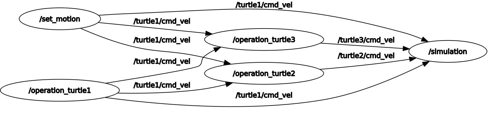

# ROS Engineering Theory and Practice: Introduction -- ROS理论与实践: Introduction

This is the solution of Assignment 01 of ROS Engineering Theory and Practice [深蓝学院](https://www.shenlanxueyuan.com/course/246).

深蓝学院ROS理论与实践第01讲Introduction作业解答. 版权归深蓝学院所有. 请勿抄袭.

---

## Solutions

---

### 1. Set Up ROS Environment
### 1. 安装ROS环境

Dockerized solution for `ROS Melodic on Ubuntu 18.04` is available [here](https://github.com/AlexGeControl/ROS-Engineer). Below are the highlights of the solution:

* Can be reproduced on any system that supports `Docker`.
* Can be accessed directly through `Web Browser`

---

### 2. Run TurtleSim with 3 Turtle Instances
### 2. 运行TurtleSim

The solution is available as a `catkin workspace`. Run the following commands to reproduce the results:

```bash
# init workspace:
catkin_init_workspace
# build release:
catkin config --install && catkin build
# up and running:
roslaunch turtles turtles.launch
```

The launch script is available [here](src/turtles/launch/turtles.launch). The core logic is shown below for easy reference:

```xml
<launch> 
    <!-- simulator -->
    <node name="simulation" pkg="turtlesim" type="turtlesim_node" /> 
    
    <!-- spawn new turtles -->
    <node name="spawn_turtle_2" pkg="rosservice" type="rosservice" args="call --wait /spawn &quot;{x: 3.0, y: 3.0, theta: 0.0, name: &apos;turtle2&apos;}&quot;" />
    <node name="spawn_turtle_3" pkg="rosservice" type="rosservice" args="call --wait /spawn &quot;{x: 8.0, y: 8.0, theta: 0.0, name: &apos;turtle3&apos;}&quot;" />

    <!-- teleop -->
    <node name="operation_turtle1" pkg="turtlesim" type="turtle_teleop_key" output="screen" />
    <node name="operation_turtle2" pkg="topic_tools" type="relay" args="/turtle1/cmd_vel /turtle2/cmd_vel" />
    <node name="operation_turtle3" pkg="topic_tools" type="relay" args="/turtle1/cmd_vel /turtle3/cmd_vel" />

    <!-- set motion -->
    <node name="set_motion" pkg="rostopic" type="rostopic" 
          args="pub -r 25 /turtle1/cmd_vel geometry_msgs/Twist '{linear: {x: 0.2, y: 0.0, z: 0.0}, angular: {x: 0.0, y: 0.0, z: 0.2}}'" />
</launch>
```

#### a. Show Computing Graph
#### a. 显示计算图结构

The computing graph is shown below:



#### b. Show Turtle Trajectories 
#### b. 显示3只海龟的运动轨迹