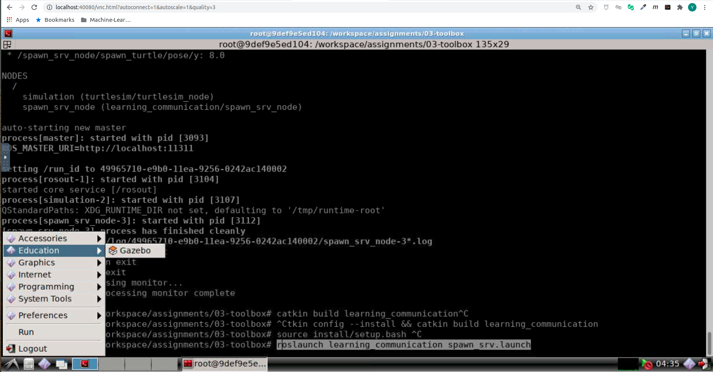
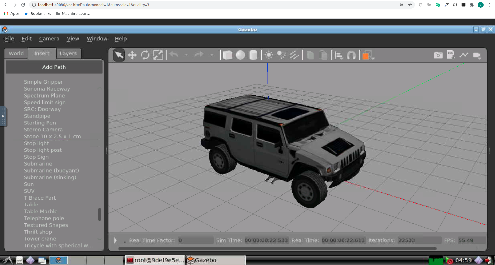

# ROS Engineering Theory and Practice: Toolbox -- ROS理论与实践: Toolbox

This is the solution of Assignment 03 of ROS Engineering Theory and Practice [深蓝学院](https://www.shenlanxueyuan.com/course/246).

深蓝学院ROS理论与实践第03讲Toolbox作业解答. 版权归深蓝学院所有. 请勿抄袭.

---

## Solutions

---

### 1. ROS Launch

创建learning_launch功能包, 在其中新建launch文件, 使用launch文件, 完成第02讲[ROS Communication](https://github.com/AlexGeControl/ROS-Engineer/tree/master/workspace/assignments/02-communication)三个项目的启动

#### Solution

The solution is available at [here](src/learning_communication). Follow the instructions below to reproduce the results

```bash
# build release:
catkin config --install && catkin build learning_communication
# set up session:
source install/setup.bash
# launch:
# a. pub-sub:
roslaunch learning_communication pub_sub.launch
# b. spawn service: 
roslaunch learning_communication spawn_srv.launch
# c. turtlesim control service:
roslaunch learning_communication turtlesim_control.launch
```

---

### 2. Gazebo

下载Gazebo离线模型库并放置在指定位置. 成功运行Gazebo后, 在系统中添加模型, 测试环境

#### Solution

Gazebo模型下载已集成至Docker环境

```Dockerfile
# download gazebo modes:
RUN mkdir -p /root/.gazebo/models &&
    git clone https://github.com/osrf/gazebo_models.git /root/.gazebo/models
```

使用Repo根目录的Docker环境, 启动Gazebo:



在Gazebo中添加模型的效果如下:



---

### 3. Learning TF2

创建learning_tf2功能包: 已知激光雷达和机器人底盘的坐标变换关系, 广播并监听机器人的坐标变换, 求解激光雷达测量值在底盘坐标系下的坐标值.

#### Solution

The solution is available at [here](src/learning_tf2). Follow the instructions below to reproduce the results

```bash
# build release:
catkin config --install && catkin build learning_tf2
# set up session:
source install/setup.bash
# launch:
roslaunch learning_tf2 learning_tf2.launch
```

The solution architect is as follows:

* `static_tf_node` Publish static tf between `base_link` and `base_laser`
* `sensor_node` Publish simulated laser scan

The transformation of laser scan between different frames is demonstrated in the attached video. The code snippet for transfowm is shown below.

```c++
void Activity::PublishPointCloud(void) {
    // create raw scan:
    pcl::PointCloud<pcl::PointXYZ> raw_scan;

    raw_scan.width  = 3;     
    raw_scan.height = 3;     
    raw_scan.points.resize(raw_scan.width * raw_scan.height);     

    try{
        // identify target pose:
        geometry_msgs::TransformStamped tf_stamped = tf_buffer_.lookupTransform(
            config_.base_link, config_.sensor_frame,
            ros::Time(0)
        );
        
        tf2::Stamped<tf2::Transform> transform;
        tf2::fromMsg(tf_stamped, transform);
        
        for (size_t i = 0; i < raw_scan.points.size (); ++i) {         
            raw_scan.points[i].x = 0.1 * (i + 1);         
            raw_scan.points[i].y = 0.0;         
            raw_scan.points[i].z = 0.0;

            tf2::Vector3 raw_scan_point(
                raw_scan.points[i].x,
                raw_scan.points[i].y,
                raw_scan.points[i].z
            );

            tf2::Vector3 obs_in_base_link = transform * raw_scan_point;

            ROS_WARN(
                "\tObservation %lu in body frame: %.4f, %.4f, %.4f", 
                i + 1,
                obs_in_base_link.getX(), obs_in_base_link.getY(), obs_in_base_link.getZ() 
            );
        } 

        // convert to ros message:
        sensor_msgs::PointCloud2 msg;
        pcl::toROSMsg(raw_scan, msg);
        msg.header.frame_id = config_.sensor_frame;

        pub_.publish(msg);
    }
    catch (tf2::TransformException &ex) {
      ROS_WARN("%s",ex.what());
    }
}
```

